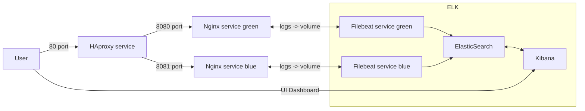

# technical_assesment_sb

## Description
All technical assesment task completed include bonus tasks.
Additional comments collected in [COMMENTS.md](./COMMENTS.md).

## 1. PYTHON OR BASH SCRIPTING - [ python_cli_tool ] 
### Enviroment used for task
```bash
- OS: Ubuntu 22.04
- python version - 3.10.4
```
### How to run
#### Supported arguments
```bash
» python3 frenamer.py -h
usage: frenamer.py [-h] [-p PREFIX] [-s SUFFIX] [--path PATH] [--reverse_order] [--debug]

options:
  -h, --help            show this help message and exit
  -p PREFIX, --prefix PREFIX
                        Prefix for renamed files (default: [audiofile])
  -s SUFFIX, --suffix SUFFIX
                        Suffix for finded files (default: [wav]
  --path PATH           Path to directory with files (default: current directory for search: [/home/anthonykelebro/Documents/github/technical_assesment_sb/python_cli_tool/])
  --reverse_order       Rename files in reverse-alphabetical order (default: [False])
  --debug               Debug mode for testinc cli-tool (defaults: [False])
```
#### Run in debug mode
```bash
cd <directory with python cli-tool>
python3 frenamer.py --debug
```
#### Example normal run
```bash
cd <directory with python cli-tool>
python3 frenamer.py -p videofile -s avi --path /home/user/Documents/Video --reverse_order
```

#### Example output
```bash
[2022-06-07 01:11:17 PM] [frenamer] (INFO) Gathering data: File <video_lalafel_532.avi> finded in directory
[2022-06-07 01:11:17 PM] [frenamer] (INFO) Gathering data: File <sector_zero_000001.avi> finded in directory
[2022-06-07 01:11:17 PM] [frenamer] (INFO) Gathering data: File <video_lalafel_568.avi> finded in directory
[2022-06-07 01:11:17 PM] [frenamer] (INFO) Gathering data: File <video_lalafel_567.avi> finded in directory
[2022-06-07 01:11:17 PM] [frenamer] (INFO) Renaming: File <video_lalafel_568.avi> renamed to <videofile_2022-06-07_000.avi>
[2022-06-07 01:11:17 PM] [frenamer] (INFO) Renaming: File <video_lalafel_567.avi> renamed to <videofile_2022-06-07_001.avi>
[2022-06-07 01:11:17 PM] [frenamer] (INFO) Renaming: File <video_lalafel_532.avi> renamed to <videofile_2022-06-07_002.avi>
[2022-06-07 01:11:17 PM] [frenamer] (INFO) Renaming: File <sector_zero_000001.avi> renamed to <videofile_2022-06-07_003.avi>
```

## 2. DOCKER - [ docker ]
### Enviroment used for task
```bash
- OS: Ubuntu 22.04
- docker version - 20.10.12
- docker-compose version - v2.6.0
```
### Connection shema

### Docker ps example output
```bash
» docker ps
CONTAINER ID   IMAGE                        COMMAND                  CREATED          STATUS          PORTS                                                                                  NAMES
c7f76645ad1c   docker_task_filebeat_green   "/bin/bash -c /usr/b…"   17 seconds ago   Up 9 seconds                                                                                           docker_task-filebeat_green-1
ce3671f74972   docker_task_filebeat_blue    "/bin/bash -c /usr/b…"   17 seconds ago   Up 9 seconds                                                                                           docker_task-filebeat_blue-1
163b14797c1f   kibana:7.17.4                "/bin/tini -- /usr/l…"   19 seconds ago   Up 11 seconds   0.0.0.0:5601->5601/tcp, :::5601->5601/tcp                                              docker_task-kibana-1
210c38d1504b   haproxy:2.6.0-alpine         "docker-entrypoint.s…"   19 seconds ago   Up 11 seconds   0.0.0.0:70->70/tcp, :::70->70/tcp, 0.0.0.0:80->80/tcp, :::80->80/tcp                   docker_task-haproxy-1
9387bb46a951   elasticsearch:7.17.4         "/bin/tini -- /usr/l…"   21 seconds ago   Up 13 seconds   0.0.0.0:9200->9200/tcp, :::9200->9200/tcp, 0.0.0.0:9300->9300/tcp, :::9300->9300/tcp   docker_task-elasticsearch-1
18769d0a48be   docker_task_nginx_blue       "/docker-entrypoint.…"   21 seconds ago   Up 13 seconds   0.0.0.0:8081->80/tcp, :::8081->80/tcp                                                  docker_task-nginx_blue-1
66c008a698fd   docker_task_nginx_green      "/docker-entrypoint.…"   21 seconds ago   Up 13 seconds   0.0.0.0:8080->80/tcp, :::8080->80/tcp                                                  docker_task-nginx_green-1
```
### How to run
```bash
cd <directory with docker-compose file>
docker-compose up or docker-compose up -d
```
### Additional information
After complete docker-compose task need wait ~2 minute for initialize filebeat and kibana dashboard for metrics.

HAproxy\Nginx web output: http://127.0.0.1
HAproxy metrics: http://127.0.0.1:70
Kibana dashboard: http://127.0.0.1:5601 (Home -> Analytics -> Dashboard -> [Filebeat Nginx] Access and error logs ECS)


## 3. ANSIBLE - [ ansible ]
### Enviroment used for task
```bash
- OS: Ubuntu 22.04
- python version - 3.10.4
- ansible version - 2.10.8
```
### Preflight: what need to be done
- Change host ip address and credential for host in __ansible/inventory/postgresql_server__
- If not need fresh generation of ssh-keypair need disable _ssh_gen_key_ option in __ansible/roles/ssh/defaults/main.yaml__
### How to run
```bash
cd <directory with ansible repo>
ansible-playbook main.yaml
```
